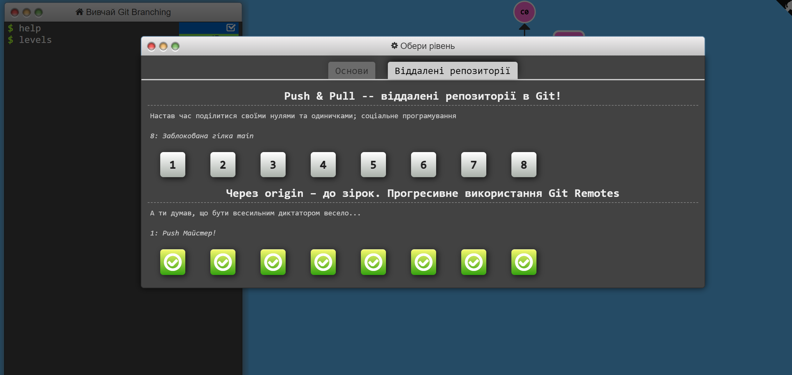

# [kottans-frontend](https://github.com/kottans/frontend)

Repository for homework of Kottans Front-End course

## Stage 0. Self-Study

## General

## Git Basics

- I`ve learnt two weeks of Coursera "Introduction to Git and GitHub" course and a few levels on [learngitbranching](learngitbranching.js.org). Before this course I learnt and used commom Git queries by myself (like push, pull, add, commit, init etc.). Learning mentioned materials helped me go deeper, understand how Git works and how to use more complex commands. Hope to become more familiar with this system. To be continued...
- As a practice, I`ve made a pull-request to [Kottans/mock-repo](https://github.com/kottans/mock-repo.git).
- Learnt some of the additional materials. Markdown course I postponed for future.

## Linux CLI, and HTTP

!
[This is a screenshot](task_linux_cli/Screenshot2022-08-11204150.png)

- Linux Survival (4 modules) - I\`ve already knew some of the basic commands like mkdir, cd, cp, mv, but there was a lot of new information like security mode, creating proper pathnames, work with printer. I was surprised how easy to work using simbols like ~, |, . I plan to use in future basic commands and special symbols for interaction with files and work with Git.

- HTTP 1/2 - I\`ve already knew some basic information about HTTP, but these aarticles made my thoughts a little clearer. I can\`t say that I understand everything but basic work of HTTP is quite understandable. I wasn\`t surbrised by any of info here, just some info was harder to understand than another. I plan to use Google Workkit and understand all about how HTTP works by becoming more experienced.

## Git Collaboration

- Introduction to Git and GitHub - actually there were a lot of new commands, especially complex but I wasn\`t surprised because I saw Git documentation before) I plan to concentrate on basic commands that helps to organize my workflow. If it would be needed I think I can learn more commands diring the workflow because I can\`t remember all of them at once and there is no need of it. It is important to undestand Git in general firstly.

- learngitbranching.js.org - this resource concentrated mainly on branching. I got to know how can I use main Git commands properly. I was surprised how simple some actions could be realised by complex commands but I need more practice to use all of them right in my workflow. I definitely will use commands for going through working tree and different commits.

